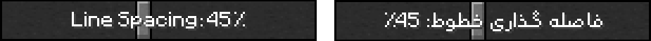

    
    <h1 align="center">Rooyin For Minecraft | رویین برای ماینکرفت</h1>
    

Arabic or Farsi font in Minecraft is not interesting at all. Ugly and small design annoys us. This source package solves our problem. Rooyin font is an Arabic (+Persian) font created by MDarvishi5124. Now this font is applied to increase the readability and beauty of Arabic texts in Minecraft.

فونت عربی یا فارسی در ماینکرفت اصلا جالب نیست. طراحی زشت و اندازۀ نامناسب آزار دهنده است. این ریسورس‌پک مشکل ما را حل می‌کند. فونت رویین یک قلم عربی (+فارسی) است که توسط MDarvishi5124 ساخته شده است. اکنون این فونت برای افزایش خوانایی و زیبایی متون عربی در ماینکرفت بکار می‌رود.

‌
‌
## 🔗 Download | دانلود

To download the Rooyin resource pack for Minecraft, you can use the [official project page](https://mdarvishi5124.github.io/Rooyin-Minecraft), or use the [releases GitHub page](https://github.com/MDarvishi5124/Rooyin-Minecraft/releases) and use [Planet Minecraft](https://www.planetminecraft.com/texture-pack/rooyin-font), [MCPEDL](https://mcpedl.com/rooyin-font)

برای دانلود ریسورس پک رویین برای ماینکرفت می‌توانید از [صفحۀ رسمی پروژه](https://mdarvishi5124.github.io/Rooyin-Minecraft) استفاده کنید، یا از [صفحۀ ریلز گیتهاب](https://github.com/MDarvishi5124/Rooyin-Minecraft/releases) استفاده کنید و از [پلنت ماینکرفت](https://www.planetminecraft.com/texture-pack/rooyin-font)، [ام‌سی‌پی‌ای‌دی‌ال](https://mcpedl.com/rooyin-font) استفاده کنید

‌
## 🈶 Language support | پشتیبانی زبان
Rooyin supports all languages ​​of the Arabic family (only languages ​​whose letters are registered by Unicode)

رویین از تمام زبان های خانواده عربی پشتیبانی می کند (فقط زبان هایی که حروف آنها توسط یونیکد ثبت شده است)

‌
## 📚 recommendations | توصیه ها

For more legibility of the font in the chat area, set the line spacing to 45%. This is a standard.

برای خوانایی بیشتر فونت در قسمت چت، فاصله خطوط را روی 45% تنظیم کنید. این یک استاندارد است.

‌
‌
## 📬 Donate | حمایت
You can use [Daramet](https://daramet.com/mdarvishi5124) to support me.

برای حمایت از من می‌توانید از درگاه [دارمت](https://daramet.com/mdarvishi5124) استفاده کنید. 
